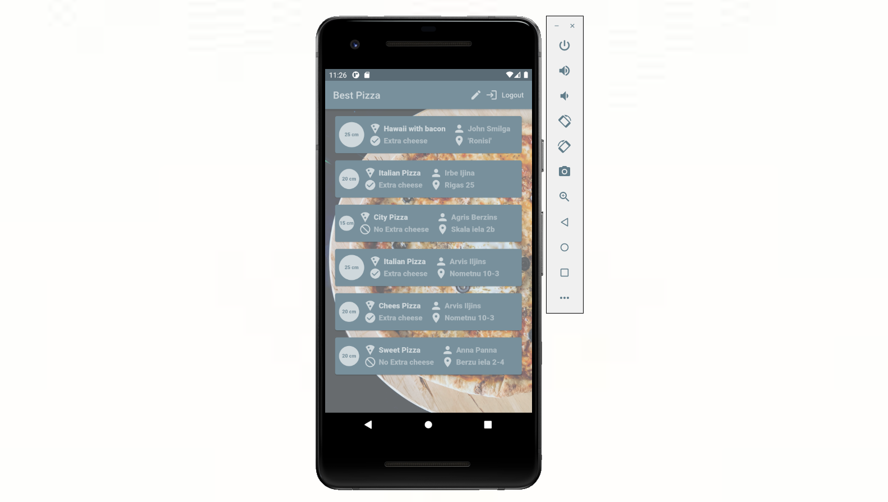
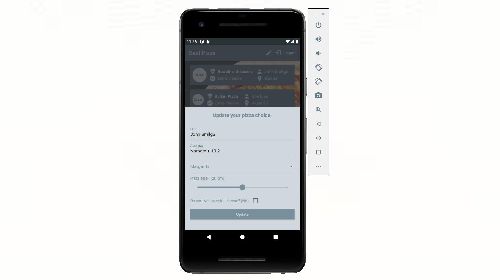
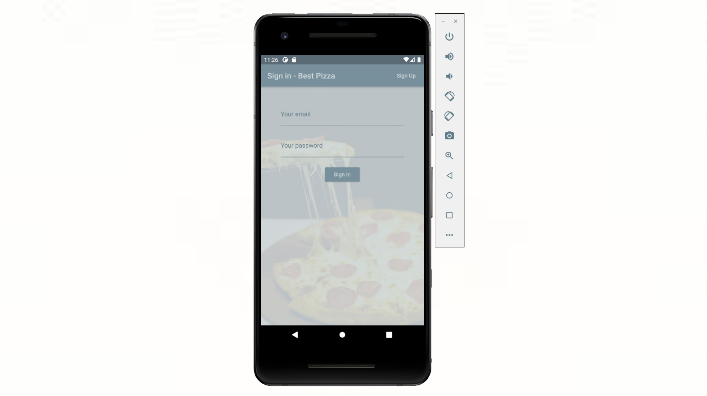

<h1>Book your pizza! App made with Flutter and Firebase.</h1>

Book your pizza live. App made with Flutter using Dart programming language. Flutter is a Cross-Platform Android, iOS, Web, and Desktop Apps Development Framework. The apps created with this tool are of high quality and with native experience at 60 frames per second. In this App, you can register and book pizza. Everyone who is registered can see your order and you can see all other orders. You can edit your order and it will be changed live. To see live changes I use Firebase. The Firebase Realtime Database lets you build rich, collaborative applications by allowing secure access to the database directly from client-side code. Data is persisted locally, and even while offline, real-time events continue to fire, giving the end-user a responsive experience. Also used the Git source control that allows you to record changes to files over time and allows you to view changes and specific versions of those files later on.

 

